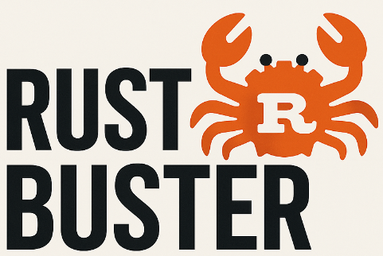
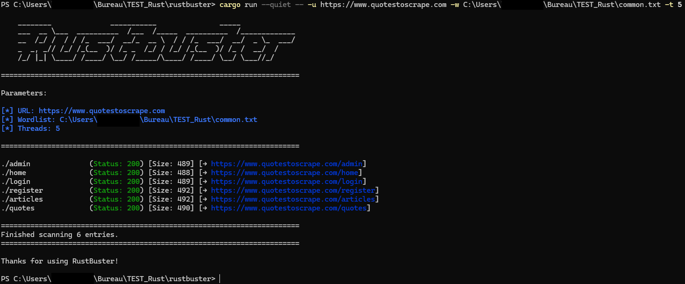

# 🦀 Rustbuster

**Rustbuster** is a fast, efficient and modern **directory brute-forcer** written in Rust.  
Inspired by tools like Gobuster, it brings high performance and clean output to web enumeration directly from your terminal.

Built for speed, precision, and clarity. It's your lightweight alternative to traditional directory scanners.

## ⚠️ Disclaimer

Rustbuster is intended **strictly for authorized security testing**.  
Do not use this tool on systems you do not own or have explicit permission to test.  
The authors are **not responsible for any misuse** or illegal activity conducted with this tool.

## 📦 Requirements

- Rust
- Cargo

## ⚙️ Installation

### 🦀 Install Rust

If you didn't installed Rust yet, you can follow the official documentation: https://www.rust-lang.org/tools/install

### 📥 Clone the repository:

```bash
git clone https://github.com/Vault-of-Jok3r/Rustbuster.git
cd Rustbuster
```

### ⚒️ Build the project:

```bash
cargo build --release
```

## 🎯 How to use :

For start Rustbuster, you need to use the command `cargo run`:

```bash
cargo run --quiet -- -u https://example.com -w path/to/wordlist.txt -t 10
```

For now, you can use those parameters:

| Flag               | Description                           |
| ------------------ | ------------------------------------- |
| `--help`, `-h`     | For help with args                    |
| `--url`, `-u`      | Target URL                            |
| `--wordlist`, `-w` | Path to the wordlist                  |
| `--threads`, `-t`  | Number of threads to use (default: 1) |
| `--output`, `-o`   | For export the result in a file       |
| `--verbose`, `-v`  | Verbose mode to see every result      |

### 🧪 Output Example



## 👨‍💻 Authors :
 
- Vault-of-Jok3r

## 🌐 Official repositories

- [Gobuster](https://github.com/OJ/gobuster) - if you want to visit the official repository of Gobuster
- [SecLists](https://github.com/danielmiessler/SecLists) - if you want some wordlists
